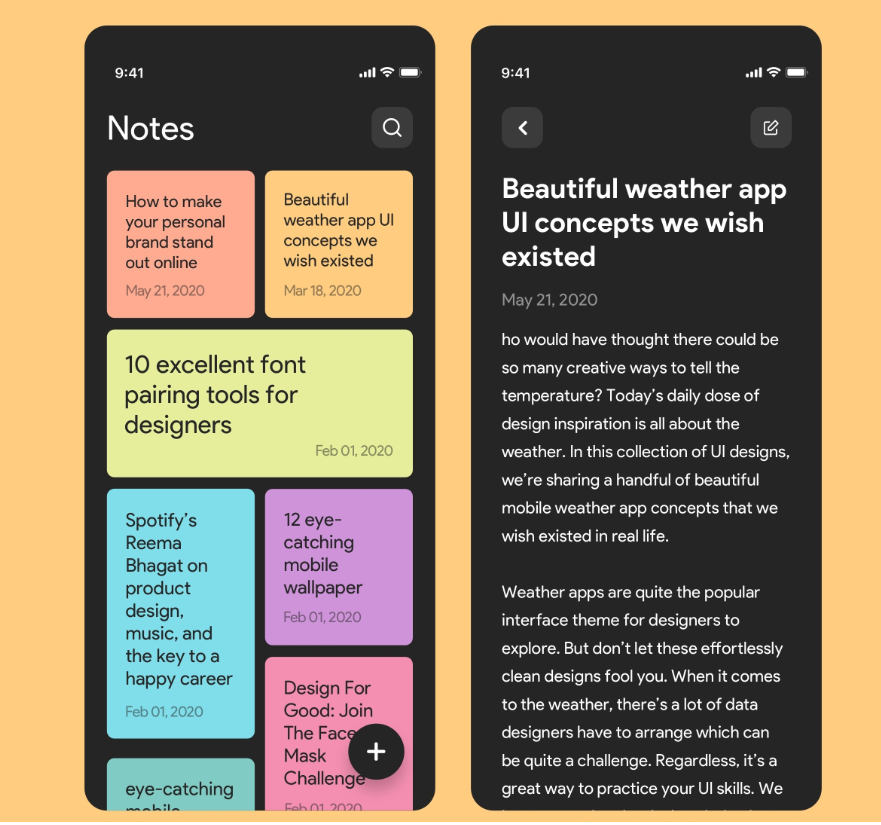

# Learning About Framework React 

## _Repository with several subjects in React_

> _Practical contents carried out during extracurricular studies._
>
> - **_JAVASCRIPT - Programming language._**
> - **_NODE.JS - Software._**

 

##  About the Project

O projeto do "React Notes App Tutorial for Beginners 2023" é um aplicativo de notas básico desenvolvido em React JS. Ele permite que os usuários criem, editem e excluam notas.

O aplicativo utiliza os conceitos fundamentais do React, incluindo a criação de componentes, gerenciamento de estado e manipulação de eventos. Além disso, ele utiliza a biblioteca externa "react-router-dom" para navegar entre as diferentes páginas do aplicativo.

Este projeto é ideal para iniciantes que desejam aprender a criar aplicativos React simples e desejam aprimorar suas habilidades no desenvolvimento web. O tutorial fornece um guia passo a passo sobre como criar o aplicativo de notas, e pode ser adaptado para criar outros aplicativos React.

Com o conhecimento adquirido neste tutorial, você poderá explorar outras funcionalidades do React e construir projetos mais avançados. Esperamos que este tutorial tenha sido útil para você e que tenha ajudado a iniciar sua jornada no desenvolvimento web com React JS.

 

---

##  Instructions for Execute the Project 

1. Make a project copy to your machine: 
    - [Git Clone](https://github.com/ArthurEstevan/Egator_Project_React_Note_2023) ⇽ Clone this repository on your computer
    - [Download](https://github.com/ArthurEstevan/Egator_Project_React_Note_2023/archive/refs/heads/main.zip) ⇽ Or a direct download from the page 

2. Import the project into your IDE and execute the application.

3. In the project directory, you can run:
    - ### `npm start`
 
    
---

##  Technologies Used

- &nbsp; IDE - Integrated development environment

- &nbsp; Frontend - Front-end Web Development 

- &nbsp; Frontend - Front-end Web Development 

- &nbsp; React - Framework Javascript.

- &nbsp; Markdown language - Text Formatting 

- &nbsp; Documentation - File Documentation

- &nbsp; Versioning - Versioning from GitHub

 

---

## 📚 _References_ 

> Channel where I learned how to do this project.

1. [Egator](https://www.youtube.com/@EGATORTUTORIALS)
2. [Site Official React](https://react.dev)
